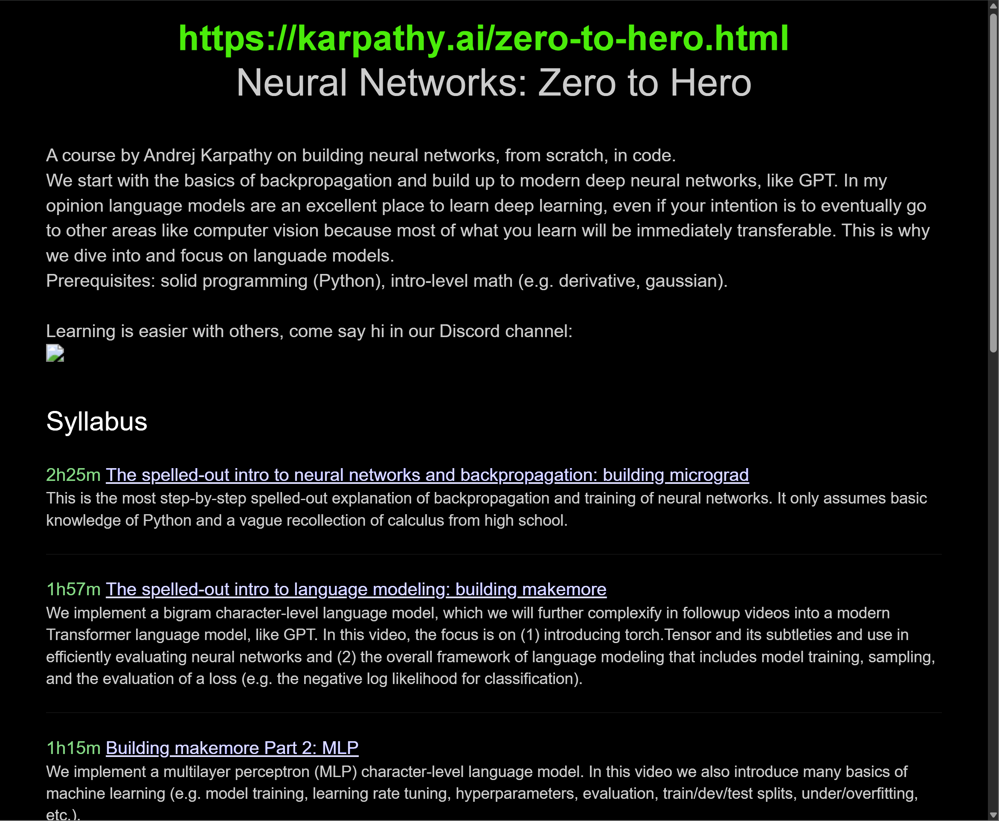
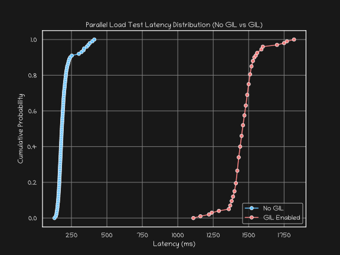
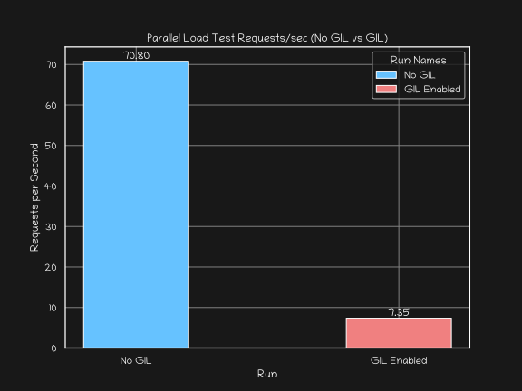
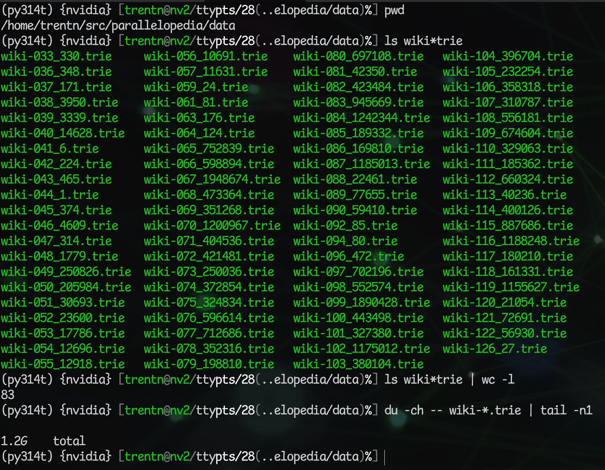

# Welcome!

## Quick Survey

::: {.incremental}

- Do you know what the Global Interpreter Lock (GIL) is?
- Have you ever been annoyed by the Global Interpreter Lock (GIL)?
- Are you excited about Python free-threading?
- Are you currently *using* Python free-threading?
- Do you do anything involving GPUs at work?
  - Both AMD & NVIDIA?
  - Mostly/only NVIDIA?
  - Mostly/only AMD?

:::

::: {.notes}
2m

Bonus: were you present for the PyData NYC 2013 PyParallel talk I gave?
:::

## About Me: Trent Nelson (trent@trent.me)
- Principal Software Engineer @ NVIDIA
- Systems Software Engineer by trade
  - Not a data scientist, quant, machine learning expert
  - But fortunate enough to have worked side-by-side with those roles
- Prior:
  - Voltron Data
  - CrowdStrike
  - Teza Technologies
  - Continuum Analytics (now Anaconda, Inc.)

::: {.notes}
1m
:::

## About this Talk

- Mostly inspired by an article I wrote in early 2025: [PyTorch and Python Free-Threading](https://trent.me/articles/pytorch-and-python-free-threading/)

::: {.notes}

Most of the content of this talk is based on an article I authored in early
2025--prior to joining NVIDIA--titled PyTorch and Python Free-Threading.  You
can find the article if you go to trent.me/articles, it's the first one.

:::

## {background-image="images/website-articles-1.png" background-size="cover"}

## Overview

- What is Python Free-Threading?  Why is it important?
- PyTorch & LLM Crash Course
- Training GPT-2 Locally
- Parallelopedia: multi-threaded, pure Python asyncio HTTP server
- Parallel PyTorch Inference via streaming asyncio HTTP server
- Hosting all of Wikipedia (from 2015) within the same process

# What is Python Free-Threading?

## The Global Interpreter Lock (GIL)

- Since the language's inception, it has had a Global Interpreter Lock (GIL)
- GIL ensures only one thread is running Python byte-code at any given time
  - This vastly simplifies the implementation details of the interpreter
  - But prevents two or more Python threads running Python byte-code
    simultaneously

## Releasing the GIL

- Extension modules (including those that ship with Python as part of the
  language) generally *release* the GIL when they transition from Python
  byte-code to their C/C++/Rust implementation.
  - Assuming it's going to be a relatively compute-intensive function that
    might not return for a bit
  - The GIL is always released before an OS system call (opening a file,
    reading a socket, etc.), as these calls could block for arbitrary amounts
    of time, preventing any other threads from running
- Once complete, the GIL is reacquired (or rather, the thread goes back to
  competing with any and all other threads that also want to hold the GIL
  so that they can resume Python byte-code execution).

## Releasing the GIL (cont.)
- Releasing the GIL allows another Python thread to acquire it and resume
  executing its Python byte-code.
- What happens if no-one is releasing the GIL?  i.e. if you've just got pure
  Python threads doing work?
  - Python will effectively time-slice between threads, so that they all get
    a chance to run for a little bit.

## {background-image="images/story-of-gil.png" background-size="contain"}

## {background-image="images/story-of-some-gil-removal-attempts.png" background-size="contain"}

## First Attempt at Removing The GIL: Greg Stein circa 1996

::: {.incremental}
- Based on Python 1.4
- Introduced fine-grain locking everywhere; Lock All The Things!
- Destroyed existing single-threaded performance
- Didn't offer desirable multi-threaded gains to offset the single-threaded
  performance hit--never made it into mainline Python
  - Also, it was 1996, multi-processor systems were expensive and not within
    the reach of consumers
- Still, Greg tackled a lot of important concepts which eventually did show
  up in mainline Python (e.g. separating global state into per-thread state)
:::

::: footer
Greg's [free threaded patch](https://github.com/tpn/python-1.4/commit/5c17e33224e2b57948ab594280a006d7648347e6),
Greg's [Free threading](https://mail.python.org/pipermail/python-dev/2001-August/017099.html) email in 2001,
Guido opining on GIL removal in [It isn't Easy to Remove the GIL](https://www.artima.com/forums/flat.jsp?forum=106&thread=214235&start=0&msRange=15),
Dave Beazely's review 15 years later: [An Inside Look at the GIL Remove Patch of Lore](https://dabeaz.blogspot.com/2011/08/inside-look-at-gil-removal-patch-of.html)
:::

::: {.notes}
- Destroyed existing single-threaded performance: mutex locking is still
  expensive (compared to incrementing or decrementing a 32-bit int by 1),
  even when there's no contention.
:::

## My Attempt in 2012 with PyParallel

::: {.incremental}
- Based on Python 3.3.5
- "Removed the GIL" (without removing the GIL)
- Design decision up-front: not "free threaded"
  - You don't create the threads
  - We create the threads!
  - And we'll call them *parallel* threads
  - And we'll come up with a way to quickly detect if we're a parallel thread
- When we need to do something thread sensitive (e.g. incref):
  - If we're a normal, GIL-holding Python thread, do what we normally do...
  - But if we're a *parallel* thread, do something **else**
:::

::: {.notes}
"Else" is clearly doing a lot of heavy lifting here.  Surprisingly, at least
with reference counting, PyParallel worked by simply not doing it.  PyParallel
callbacks didn't need to mutate reference counts because they could rely on
temporal objects being cleaned up after the callback returned.  And objects
created outside of the parallel callback would have reference count values
higher than one, and there was no risk of them going to zero whilst parallel
threads were running.
:::

## PyParallel

- PyParallel Website: [https://pyparallel.org](https://pyparallel.org)
  - Links to GitHub, Decks, Download, etc.
- PyData NYC 2013 first public presentation titled *"PyParallel: How we removed the GIL and exploited all cores (without needing to remove the GIL at all)"*
  [https://speakerdeck.com/trent/pyparallel-how-we-removed-the-gil-and-exploited-all-cores](https://speakerdeck.com/trent/pyparallel-how-we-removed-the-gil-and-exploited-all-cores)

## {background-video="images/pyparallel-website.webm" background-size="contain"}

## {background-image="images/speakerdeck-pyparallel.png" background-size="contain"}

## PyParallel: Pros & Cons

:::: {.columns}

::: {.column width="50%"}

:::: {.incremental}
- Pros:
  - Successful proof of concept!
  - Linear scaling with core count
  - Great performance (rivaling C libraries)...
    - As long as you were writing stateless/indempotent TCP socket servers
  - NumPy, datrie, pyodbc, and Cython support
  - All the async I/O internal machinery was written in C, extensively leveraged
    Windows thread pools, completion ports and overlapped I/O, and still
    outperforms most things today
::::

:::

::: {.column width="50%"}

:::: {.incremental}

- Cons:
  - Could only leverage multiple threads via async socket servers
    - No free threaded support
  - There were a lot of things you COULDN'T do in parallel callbacks
    - Couldn't (easily) mutate shared state
    - Couldn't import modules
    - Couldn't coordinate or cooperate with other parallel callbacks
  - Worse still, we couldn't detect if you did some of these things and
    stop you ahead of time; we just crashed
::::

:::

::::

## PyParallel Cons Continued

::: {.incremental}
- More Cons:
  - Pure hack fest; not remotely suitable for production
    - (But really fast when it didn't crash!)
  - Windows only
    - Solely used Windows-only APIs for which there are no counterparts on Linux
      or Mac OS X (threadpools, overlapped I/O, etc.)
    - Never had any chance on running on anything except Windows without a
      fundamental redesign
:::

# And Then There Was Free-Threaded Python!

## Python Free-Threading Is Here!

- [PEP-703: Making the Global Interpreter Lock Optional in CPython](https://peps.python.org/pep-0703/)
- Python 3.13t, released in October 2024, first version to introduce support
  for new, "no-GIL", free-threaded mode
- Herculean effort by Sam Gross and many others at Meta (and elsewhere) over
  many years
- Best thing to happen to Python since its inception!

## Simultaneous Multi-Threading Is Here!

:::: {.columns}

::: {.column width="50%"}

Simple Example

```python
import threading

def expensive_op():
    # Some CPU intensive work here
    ...

threads = [
    threading.Thread(target=expensive_op)
        for _ in range(8)
]
for t in threads:
    t.start()

for t in threads:
    t.join()
```

:::

::: {.column width="50%"}

:::

::::

## Simultaneous Multi-Threading Is Here!

:::: {.columns}

::: {.column width="50%"}

Simple Example

```python
import threading

def expensive_op():
    # Some CPU intensive work here
    ...

threads = [
    threading.Thread(target=expensive_op)
        for _ in range(8)
]
for t in threads:
    t.start()

for t in threads:
    t.join()
```

:::

::: {.column width="50%"}

Real World Example

```python
from concurrent.futures import ThreadPoolExecutor, as_completed

def do_work(chunk):
    ...

work = [...] # Some list of work items
errors = []
results = []
max_workers = min(os.cpu_count(), len(work))
with ThreadPoolExecutor(max_workers=max_workers) as executor:
    futures = {
        executor.submit(do_work, item): item
            for item in work
    }
    for future in as_completed(futures):
        try:
            result = future.result()
            results.append(result)
        except Exception as e:
            errors.append(e)
```

:::

::::

## It's Not Quite A Panacea... Yet.

- Not all 3rd party modules support free-threading yet
- It isn't the default (yet); you have to opt-in to it
  - e.g. `conda create -n py314 python=3.14 python-freethreading`

. . .

- But these are all things that'll eventually go away
- And it has the full support of the Python Software Foundation and Steering
  Council!

. . .

- And you can do really cool stuff with it today!

# PyTorch LLM Crash Course

## Neural Networks: From Zero to Hero

:::: {.columns}

::: {.column width="60%"}


- My prior LLM & PyTorch experience: zero
- [Andrej Karpathy](https://karpathy.ai) has a YouTube Series on deep neural
  networks and LLMs titled [Neural Networks: From Zero to Hero](
https://www.youtube.com/playlist?list=PLAqhIrjkxbuWI23v9cThsA9GvCAUhRvKZ)
- Nearly 20 hours of content across 10 videos
  - Took me at least double that over ~2 weeks to really absorb everything
- From first principles to training your very own GPT-2

:::

::: {.column width="40%"}



:::

::::

## Training GPT-2 (124M) Locally

- Equipped with:
  - Final video in the series: [Let's reproduce GPT-2 (124M)](https://www.youtube.com/watch?v=l8pRSuU81PU&list=PLAqhIrjkxbuWI23v9cThsA9GvCAUhRvKZ&index=10&t=1286s&pp=iAQB)
  - Accompanying GitHub repo [build-nanogpt](https://github.com/karpathy/build-nanogpt)
- I was able to train a local GPT-2 model from scratch
  - Took ~3.5 days on a DGX Workstation from 2017 (4xTesla V100-DGXS-32GB)
  - Have since rerun on single 5090 and calculated training would have taken
    about 14 hours or so
- End result: `model_19072.pt`

## Attention Is All You Need {background-image="images/attention-is-all-you-need.png" background-size="contain"}

## Source Code: https://github.com/tpn/parallelopedia

:::: {.columns}

::: {.column width="40%"}
- [parallelopedia.gpt2](https://github.com/tpn/parallelopedia/blob/main/src/parallelopedia/gpt2.py)
  module (based off `build-nanogpt`'s [train_gpt2.py](https://github.com/karpathy/build-nanogpt/blob/master/train_gpt2.py)):
- Key classes:
  - `CausalSelfAttention`
  - `MLP` (multi-layer perceptron)
  - `Block`
  - `GPT`
- Key method: `GPT.generate()`

:::

::: {.column width="60%"}
```{.python code-line-numbers="1-48|53-66|69-81|84|88-193"}

```
:::

::::

## Loading the Model

```python
>>> model = GPT.from_local_pretrained('model_19072.pt', map_location='cuda')
# 2025-02-09 15:26:39,136 - INFO - Loaded model from step 19072, val_loss 3.0519702434539795
```
. . .
```python
>>> print(repr(model))
GPT(
  (transformer): ModuleDict(
    (wte): Embedding(50304, 768)
    (wpe): Embedding(1024, 768)
    (h): ModuleList(
      (0-11): 12 x Block(
        (ln_1): LayerNorm((768,), eps=1e-05, elementwise_affine=True)
        (attn): CausalSelfAttention(
          (c_attn): Linear(in_features=768, out_features=2304, bias=True)
          (c_proj): Linear(in_features=768, out_features=768, bias=True)
        )
        (ln_2): LayerNorm((768,), eps=1e-05, elementwise_affine=True)
        (mlp): MLP(
          (c_fc): Linear(in_features=768, out_features=3072, bias=True)
          (gelu): GELU(approximate='tanh')
          (c_proj): Linear(in_features=3072, out_features=768, bias=True)
        )
      )
    )
    (ln_f): LayerNorm((768,), eps=1e-05, elementwise_affine=True)
  )
  (lm_head): Linear(in_features=768, out_features=50304, bias=False)
)
```

## Generating Text (Inference)

```python
prompt = "Albert Einstein's Theory of Relativity stated that"
result = model.generate(prompt, seed=42)
print(result)
```
. . .

> Albert Einstein's Theory of Relativity stated that the speed of light was
> approximately 10 000 of parsecs, whereas quantum physicists have suggested
> that, as we move further into the universe, the universe might grow older. The
> new experiment, conducted by researchers at the University of New Jersey, New
> York, and the University of California, Berkeley shows that photons travelling
> at the speed of light will be around 30 to 65 kilometres per second.

## Ablation: Generate Text after Second Step of Training

```python
>>> model = GPT.from_local_pretrained('model_00002.pt', map_location='cuda')
>>> result = model.generate(prompt, seed=1943656378)
>>> print(result)
```
. . .

> Albert Einstein's Theory of Relativity stated that rosterExc Willis
> occasional297 coveted narrowerggle antibioticleyVG}; sentencesble
> defenderWrit382ooooooteen Phone368 painting appointedExc Strawberry
> endorsementsfrequencyatographycesbyssDrDr photoDoug bargain weeds belongings
> drain effectiveness Ron toyVG summarized discrete adaptingmetry
> raysrethmareinel Placesinqu Killed hotline Property Conc,plin RadeonCHR
> grippedcommunityICspread relentless 1886 nat natmoremoreInstructasin368 rays
> f&%#@&# FRI archaic everybody psychiatrists effectiveness Rudduedworldly Cul
> messenger Cou mark mark Breakfast reincarn alienatedinately deepestiana
> induction resign effectiveness sucks 153chelladdin UFC psychiatrists targeted
> excellent seals psychiatrists Ud depended Fibbrook preced contributors

::: {.notes}
Second step of training = less than five seconds of training.
:::

# The Road to Parallel PyTorch Inference

## Recap

::: {.incremental}

- We have Python free-threading...
- We have a (janky) GPT-2 PyTorch Model that generates text when prompted...
- Next question: does it work when called from multiple-threads?
- *Obviously* the simplest way to answer this question would have been:
  - Try calling it from multiple threads.
:::
. . .

```python
model = GPT.from_local_pretrained('model_19072.pt', map_location='cuda')
prompt = "Albert Einstein's Theory of Relativity stated that"

def generate(seed):
    return model.generate(prompt, seed=seed)

with ThreadPoolExecutor(max_workers=8) as executor:
    futures = [
        executor.submit(generate, seed)
            for seed in range(8)
    ]
    for future in as_completed(futures):
        print(future.result()
```

## {background-image="images/anakin.jpg" background-size="contain"}

## Why Do Something In 30 Seconds When You Can Also Do It In 30+ Hours?

::: {.incremental}
- Boring: quick test to see if you can call `model.generate()` from multiple threads
- Wouldn't it be cooler to write a multi-threaded async I/O HTTP server
  - And expose `/generate`-esque `GET` endpoint for doing inference
  - And have it stream tokens in real-time
  - And implement it all using the new `asyncio` Python libraries
  - And then maybe vibe-code a fancy React front-end web UI
:::

## Parallelopedia To The Rescue

Setup
```bash
conda create -n py314t python=3.14 python-freethreading nodejs pandoc -c conda-forge
conda activate py314t
cd ~/src
git clone https://github.com/tpn/parallelopedia
cd parallelopedia
pip install -e .
cd ui
npm install
```
. . .

Launch UI
```bash
cd ~/src/parallelopedia/ui
npm run start
```
. . .

Launch Server
```bash
python -Xgil=0 -m parallelopedia.http.server --threads $(nproc) --ip 0.0.0.0 --port 4444 --log-level INFO \
    --app-classes parallelopedia.http.server.PlaintextApp \
                  parallelopedia.gpt2.Gpt2App \
                  parallelopedia.wiki.WikiApp
```

## Demo (or video if demo isn't working)

## {background-video="images/parallelopedia-gpt2-demo.webm" background-size="contain"}

## How It Works

- `asyncio`-based PyTorch model generation routine that yields a single
  (decoded) token at a time

. . .

- Leverages HTTP chunked encoding for the streaming effect
  - Enabled via `Transfer-Encoding: chunked` header
  - Response is composed of length-prefixed chunks, separated by newlines

## HTTP Chunked Encoding Example

Normal curl:
```bash
% curl 'http://localhost:4444/gpt2/generate/The%20quick%20brown%20fox?max_length=20&device=cuda&seed=42'
The quick brown fox is a subspecies that originated in southern Scotland as a variety of fox. This
```

. . .

But if we pipe a manual HTTP GET request via `netcat`:
```bash
% echo -en \
 'GET /gpt2/generate/The%20quick%20brown%20fox?max_length=20&device=cuda&seed=42 ' \
 'HTTP/1.1\r\nConnection: close\r\nHost: dgx\r\n\r\n' | nc dgx 4444
```

. . .

We can see the chunked response (without curl reassembling it):

```{.bash code-line-numbers="|8|16-17|18-50"}
HTTP/1.1 200 OK
Server: Parallelopedia Web Server v1.0
Date: Fri, 07 Feb 2025 23:32:02 GMT
Accept-Ranges: bytes
Content-Type: text/plain
Access-Control-Allow-Origin: *
Connection: close
Transfer-Encoding: chunked
Access-Control-Expose-Headers: X-Max-Length, X-Top-K, X-Seed, X-Model-Name, X-Model-Device
X-Max-Length: 20
X-Top-K: 50
X-Seed: 42
X-Model-Name: gpt2
X-Model-Device: cuda:0

13
The quick brown fox
3
 is
2
 a
4
 sub
7
species
5
 that
B
 originated
3
 in
9
 southern
9
 Scotland
3
 as
2
 a
8
 variety
3
 of
4
 fox
1
.
5
 This
0
```

## But Does It Actually Work In Parallel?

- The next slide shows a `tmux` session of six boxes running curl against the
  `/generate` endpoint simultaneously (via tmux `:synchronize-panes`)

## {background-image="images/parallelopedia-multi-threaded-gpu-inference-gpt2-curl-1000.gif" background-size="contain"}

## Load Test!

- The next slide shows a GPU-enabled `btop` running in the background, and a
  foreground `wrk` load test session that uses 14 threads to issue back-to-back
  requests for 30 seconds (i.e. as fast as possible)

## {background-image="images/parallelopedia-multi-threaded-gpu-inference-gpt2-wrk-14.gif" background-size="contain"}

## No GIL vs GIL Performance For Parallel PyTorch Inference

:::: {.columns}

::: {.column width="50%"}

_Latency Distribution_

- Lower latency & straigher line better



:::

::: {.column width="50%"}

_Requests Per Second_

- Bigger is better



:::

::::

## What's The Catch?
::: {.incremental}
- Torch Dynamo
  - Add a `@torch.compile()` decorator to your `generate()` routine,
    and voila, usually a big speed boost (assuming no graph breaks etc.)
  - Unfortunately:
    - Doesn't work with free-threading
    - Doesn't work with an `async def generate()` routine
  - So you're leaving GPU performance on the table (i.e. you're not max
    performing a modern GPU)
- No batching, KV cache, paging, etc.
  - Much better tools for the job if you're putting a ChatGPT-style chatbot into
    production, e.g. NVIDIA Triton, vLLM
:::

## So What's The Point?

- Even if we're not deploying a max-performing model inference...
- Being able to do PyTorch model inference in parallel within a single Python
  process is still very cool
  - And it's infinitely better than `multiprocessing`
    - No expensive process context switches
    - No expensive GPU CUDA context switches
    - No memory waste due to duplicating models in multiple processes
- And it works with contemporary models from HuggingFace!*

. . .


## In The Real World, Where Python Gets Stuff Done...

::: {.incremental}

- For every production, public-facing ChatGPT-style chatbot website, there are
  probably hundreds of thousands internal apps teams use to get their work done

- Common pattern I observed for Python projects in my consultancy days:
  - Load a bunch of reference data
    - Account details, stock details, geographic data, entity data
    - *"Dimension"* tables in data warehousing parlance
    - Concretely: usually NumPy arrays, Arrow files, Pandas data frames, etc.
  - Then process a bunch of transactional data that refers to this reference
    data
    - Bank transfers, ad clicks, stock ticker data, etc.
    - *"Fact"* tables in data warehousing parlance
  - Brutal in the `multiprocessing` days; each process would need its own copy
    of all the read-only reference data, huge memory overhead, huge startup
    cost because each Python process had to load everything serially

- Python free-threading is perfect for these use cases!

:::

# Putting the opedia in Parallelopedia with an embedded Wikipedia

## Embedding Wikipedia

- To hammer home the point that Python free-threading is the bees knees...

. . .

- *Especially* when it comes to loading large data structures in parallel...

. . .

- And then being able to reference those data structures via multiple threads
  running simultaneously across multiple cores...

. . .

- Let's just straight-up host all of Wikipedia in this same process!

. . .

- So, specifically, we want to implement HTTP endpoints that:
  - Provide a means to *"prefix search"* Wikipedia titles
    - i.e. *"What are all the Wikipedia article titles beginning with "Dave'?"*
  - Provide a means to look up an article directly for a given title

## On Embedding Wikipedia

::: {.incremental}
- All that's needed: two simple data structures and `mmap`

- For the prefix searching of Wikipedia article titles:
  - A *trie* (digital search tree) of all titles mapped to the byte offset of
    that title within the Wikipedia XML dump
  - The *trie* facilitates the prefix matching (we use the Python `datrie`
    module, which wraps the C library `libdatrie`)
- For article lookup:
  - A sorted NumPy array of all the absolute byte offsets of each title
    in the XML dump
  - i.e. all of the values in the prefix trie above
- More details:
  - [https://huggingface.co/datasets/trentnelson/parallelopedia](https://huggingface.co/datasets/trentnelson/parallelopedia)
:::

## Parallelopedia Wiki Demo

## {background-video="images/parallelopedia-wiki-demo-nvidia.webm" background-size="contain"}

## Parallelopedia Wiki Details

:::: {.columns}

::: {.column width="%50"}

The *"trie"* for the prefix search is actually 83 tries:



(Ordinal of first character, number of titles)

:::

::: {.column width="%50"}

:::: {.incremental}

- Only one sorted NumPy array of offsets (`title_offsets.npy`, ~120MB)
- We can load all the tries in parallel at startup (~2s instead of ~12s)
- Much quicker to create tries when they're partitioned by first char
- Exact lookup of article offset from trie is O(L) where L is length of title
- Once we have the start offset, we can do `offsets.searchsorted()` to find the
  absolute index (binary search, O(log(n)))
- `offsets[index+1]` gives us the next article's start offset; we can impune our
  end offset from that, and once we have start:end byte range...
- `article = WIKI_XML_MMAP[start:end]`

::::

:::

::::

## Parallelopedia: Wiki Offsets: Example

```{.bash code-line-numbers="1-2|19-23"}
# Prefix search for all Wikipedia titles starting with "NVIDIA"
% curl -s 'http:/localhost:4444/wiki/offsets?name=NVIDIA' | jq
[
  [
    "NVIDIA",
    22766678654,
    22766679438
  ],
  [
    "NVIDIA APX 2500",
    23352741597,
    23352742253
  ],
  [
    "NVIDIA BR02",
    13596637221,
    13596638658
  ],
  [
    "NVIDIA CUDA Compiler",
    44569709658,
    44569713061
  ],
  [
    "NVIDIA Corp.",
    5788837214,
    5788837833
  ],
  [
    "NVIDIA Corporation",
    651080622,
    651081295
  ],
  [
    "NVIDIA Demos",
    22809850380,
    22809851014
  ],
  [
    "NVIDIA Fermi architecture",
    48728474350,
    48728475044
  ],
  [
    "NVIDIA GPU",
    11121527047,
    77962511121527771
  ],
  [
    "NVIDIA GeForce",
    9962883941,
    9962884521
  ],
  [
    "NVIDIA GeForce 2",
    19183001103,
    19183001759
  ],
  [
    "NVIDIA GeForce GT 325M",
    33767058820,
    33767059557
  ],
  [
    "NVIDIA GeForce GT 330M",
    40152066548,
    40152067339
  ],
  [
    "NVIDIA GeForce2",
    19183798188,
    19183798843
  ],
  [
    "NVIDIA Geforce",
    20134644772,
    20134645360
  ],
  [
    "NVIDIA Geforce 2",
    19183010738,
    19183011394
  ],
  [
    "NVIDIA Gelato",
    14528272767,
    14528273352
  ],
  [
    "NVIDIA ION",
    31045259177,
    31045259818
  ],
  [
    "NVIDIA Ion",
    29311428186,
    29311428809
  ],
  [
    "NVIDIA N40",
    10682812474,
    10682813122
  ],
  [
    "NVIDIA NV40",
    10682807609,
    10682808258
  ],
  [
    "NVIDIA Optimus",
    47942318714,
    47942319313
  ],
  [
    "NVIDIA PhysX",
    24815008675,
    24815009220
  ],
  [
    "NVIDIA PureVideo",
    22804676127,
    22804676810
  ],
  [
    "NVIDIA Quadro",
    22809845936,
    22809846572
  ],
  [
    "NVIDIA Quadro Plex",
    22812333404,
    22812334055
  ],
  [
    "NVIDIA Riva 128",
    14127586968,
    14127587526
  ],
  [
    "NVIDIA SLI",
    18802268476,
    18802269118
  ],
  [
    "NVIDIA Shield",
    46112329042,
    46112329690
  ],
  [
    "NVIDIA System Tools",
    31044107641,
    31044108309
  ],
  [
    "NVIDIA Tegra",
    24621784228,
    24621784882
  ],
  [
    "NVIDIA Tegra 2",
    37853790611,
    37853791235
  ],
  [
    "NVIDIA Tesla",
    22804600742,
    22804601403
  ],
  [
    "NVIDIA and FOSS",
    16092716596,
    16092717279
  ],
  [
    "NVIDIA demos",
    34541153992,
    34541154671
  ],
  [
    "NVIDIA n40",
    10682813126,
    10682813774
  ],
  [
    "NVIDIA nv40",
    10682817796,
    10682818445
  ]
]
```

## Parallelopedia: Wiki Lookup via Byte Range: Example

```{.bash code-line-numbers="1-7|9-91"}
# Issue a ranged request for a given article in XML (native/raw) format:
#  [
#    "NVIDIA CUDA Compiler",
#    44569709658,
#    44569713061
#  ],
% curl -i -sS -H 'Range: bytes=44569709658-44569713061" http://localhost:4444/wiki/xml

HTTP/1.1 206 Partial Content
Server: Parallelopedia Web Server v1.0
Date: Fri, 07 Nov 2025 20:47:51 GMT
Accept-Ranges: bytes
Content-Type: text/xml; charset=utf-8
Access-Control-Allow-Origin: *
Last-Modified: Sun, 02 Nov 2025 00:33:19 GMT
Content-Range: 44569709658-44569713061/51642517367
Content-Length: 3404

<page>
    <title>NVIDIA CUDA Compiler</title>
    <ns>0</ns>
    <id>37864839</id>
    <revision>
      <id>611673801</id>
      <parentid>602261027</parentid>
      <timestamp>2014-06-05T12:48:54Z</timestamp>
      <contributor>
        <username>ScotXW</username>
        <id>19568210</id>
      </contributor>
      <model>wikitext</model>
      <format>text/x-wiki</format>
      <text xml:space="preserve">{{Infobox software
| name                   =
| title                  =
| logo                   = &lt;!-- Image name is enough --&gt;
| logo caption           =
| logo_size              =
| logo_alt               =
| screenshot             = &lt;!-- Image name is enough --&gt;
| caption                =
| screenshot_size        =
| screenshot_alt         =
| collapsible            =
| author                 = [[Nvidia]]
| developer              =
| released               = &lt;!-- {{Start date and age|YYYY|MM|DD|df=yes/no}} --&gt;
| discontinued           =
| latest release version =
| latest release date    = &lt;!-- {{Start date and age|YYYY|MM|DD|df=yes/no}} --&gt;
| latest preview version =
| latest preview date    = &lt;!-- {{Start date and age|YYYY|MM|DD|df=yes/no}} --&gt;
| status                 =
| programming language   =
| operating system       =
| platform               =
| size                   =
| language               =
| language count         = &lt;!-- DO NOT include this parameter unless you know what it does --&gt;
| language footnote      =
| genre                  = [[compiler]]
| license                = [[proprietary software]]
| website                = {{URL|http://docs.nvidia.com/cuda/cuda-compiler-driver-nvcc/#introduction}}
}}

''' Nvidia CUDA Compiler''' ('''NVCC''') is a [[proprietary software|proprietary]] [[compiler]] by [[Nvidia]] intended for use with [[CUDA]]. CUDA codes runs on both the [[CPU]] and [[GPU]]. NVCC separates these two parts and sends host code (the part of code which will be run on the [[CPU]]) to a [[C (programming language)|C]] compiler like [[GNU Compiler Collection|GCC]] or [[Intel C++ Compiler]] (ICC) or [[Microsoft Visual C]] Compiler, and sends the device code (the part which will run on the GPU) to the GPU. The device code is further compiled by NVCC.

Any source file containing CUDA language extensions (.cu) must be compiled with nvcc. NVCC is a compiler driver which works by invoking all the necessary tools and compilers like cudacc, g++, cl, etc. NVCC can output either C code (CPU Code) that must then be compiled with the rest of the application using another tool or PTX or object code directly. An executable with CUDA code requires: the CUDA core library (cuda) and the CUDA runtime library (cudart).

Other widely used libraries:
* CUBLAS: BLAS implementation
* CUFFT: FFT implementation
* CUDPP (Data Parallel Primitives): Reduction, Scan, Sort.
* Thrust: Reduction, Scan, Sort.

== See also ==
* [[OpenCL]]
* [[Heterogeneous System Architecture]]

== References ==
# David B. Kirk, and Wen-mei W. Hwu. Programming massively parallel processors: a hands-on approach. Morgan Kaufmann, 2010.
# Nvidia Documentation on nvcc. http://docs.nvidia.com/cuda/cuda-compiler-driver-nvcc/
# CUDPP. http://gpgpu.org/developer/cudpp

[[Category:Nvidia]]
[[Category:Compilers]]

{{computer-stub}}</text>
      <sha1>pl6clr73ogqryucxi4cbtrr730jehfz</sha1>
    </revision>
  </page>
```

## Parallelopedia: Wiki Lookup via Exact Title: Example

```{.bash code-line-numbers="1-2|4-54"}
# Exact title lookup and post-process via Pandoc to HTML in one go: % curl -s 'http://localhost:4444/wiki/wiki?name=NVIDIA%20CUDA%20Compiler'

<p><strong>Nvidia CUDA Compiler</strong> (<strong>NVCC</strong>) is a <a
href="proprietary_software" class="wikilink"
title="proprietary">proprietary</a> <a href="compiler" class="wikilink"
title="compiler">compiler</a> by <a href="Nvidia" class="wikilink"
title="Nvidia">Nvidia</a> intended for use with <a href="CUDA"
class="wikilink" title="CUDA">CUDA</a>. CUDA codes runs on both the <a
href="CPU" class="wikilink" title="CPU">CPU</a> and <a href="GPU"
class="wikilink" title="GPU">GPU</a>. NVCC separates these two parts and
sends host code (the part of code which will be run on the <a href="CPU"
class="wikilink" title="CPU">CPU</a>) to a <a
href="C_(programming_language)" class="wikilink" title="C">C</a>
compiler like <a href="GNU_Compiler_Collection" class="wikilink"
title="GCC">GCC</a> or <a href="Intel_C++_Compiler" class="wikilink"
title="Intel C++ Compiler">Intel C++ Compiler</a> (ICC) or <a
href="Microsoft_Visual_C" class="wikilink"
title="Microsoft Visual C">Microsoft Visual C</a> Compiler, and sends
the device code (the part which will run on the GPU) to the GPU. The
device code is further compiled by NVCC.</p>
<p>Any source file containing CUDA language extensions (.cu) must be
compiled with nvcc. NVCC is a compiler driver which works by invoking
all the necessary tools and compilers like cudacc, g++, cl, etc. NVCC
can output either C code (CPU Code) that must then be compiled with the
rest of the application using another tool or PTX or object code
directly. An executable with CUDA code requires: the CUDA core library
(cuda) and the CUDA runtime library (cudart).</p>
<p>Other widely used libraries:</p>
<ul>
<li>CUBLAS: BLAS implementation</li>
<li>CUFFT: FFT implementation</li>
<li>CUDPP (Data Parallel Primitives): Reduction, Scan, Sort.</li>
<li>Thrust: Reduction, Scan, Sort.</li>
</ul>
<h2 id="see_also">See also</h2>
<ul>
<li><a href="OpenCL" class="wikilink" title="OpenCL">OpenCL</a></li>
<li><a href="Heterogeneous_System_Architecture" class="wikilink"
title="Heterogeneous System Architecture">Heterogeneous System
Architecture</a></li>
</ul>
<h2 id="references">References</h2>
<ol>
<li>David B. Kirk, and Wen-mei W. Hwu. Programming massively parallel
processors: a hands-on approach. Morgan Kaufmann, 2010.</li>
<li>Nvidia Documentation on nvcc. <a
href="http://docs.nvidia.com/cuda/cuda-compiler-driver-nvcc/">http://docs.nvidia.com/cuda/cuda-compiler-driver-nvcc/</a></li>
<li>CUDPP. <a
href="http://gpgpu.org/developer/cudpp">http://gpgpu.org/developer/cudpp</a></li>
</ol>
<p><a href="Category:Nvidia" class="wikilink"
title="Category:Nvidia">Category:Nvidia</a> <a href="Category:Compilers"
class="wikilink" title="Category:Compilers">Category:Compilers</a></p>
```

## Parallelopedia: Wiki Names & Offsets: Summary

- The prefix search is done via a `/wiki/offsets` endpoint, which returns the
  title, start byte offset and end byte offset
- The `/wiki/html` and `/wiki/xml` endpoints require a `Range: bytes=<start>:<end>`
  header, and response with the corresponding bytes at that range, optionally
  post-processed via Pandoc for the HTML case
- The `/wiki/wiki?name=<exact-title>` will skip the prefix search and just do a
  single title lookup in the appropriate trie and then return the post-processed
  Pandoc HTML (or raw XML if `/wiki/wiki_xml` is used)

## Parallopedia Tries

- Although only ~1.2GB on disk, roughly ~6GB increase in process memory once
  loaded:

```bash
ading 83 tries in parallel with 64 threads...
Loaded 83 tries in 2.0675 seconds.
Process memory (RSS): before=1.63 GB, after=7.77 GB, delta=6.15 GB
```

- So in `multiprocessing` days, assuming this was your only expensive data
  structure:
  - 64 separate processes all consuming >8GB RAM each
  - At *least* 512GB RAM required total just for the RSS of all processes; so
    realistically you'd need 768GB RAM in the actual machine
  - Additional 12s+ startup time before any useful work can be done

- Just gets worse as you get more cores.
  - NVIDIA's x64 Blackwell B200/B300 machines have 224 cores!
  - 1,792MB of RAM just for the Python processes!

## On HuggingFace...

## {background-video="images/parallelopedia-llm-demo.webm" background-size="contain"}

# Questions?

# Resources

## Links & Contact

- This deck: [https://trent.me/decks/pytorch-and-python-free-threading](https://trent.me/decks/pytorch-and-python-free-threading)
  - Deck source: [https://github.com/tpn/website/blob/main/decks/pytorch-and-python-free-threading/index.qmd](https://github.com/tpn/website/blob/main/decks/pytorch-and-python-free-threading/index.qmd)
- Original PyTorch & Python Free Threading Article:
  - [https://trent.me/articles/pytorch-and-python-free-threading/](https://trent.me/articles/pytorch-and-python-free-threading/)
- Parallelopedia on Github
  - [https://github.com/tpn/parallelopedia](https://github.com/tpn/parallelopedia)
  - Includes Python backend (`src/parallelopedia`) and React frontend (`ui`).
- Parallelopedia on HuggingFace
  - Wiki data: [https://huggingface.co/datasets/trentnelson/parallelopedia](https://huggingface.co/datasets/trentnelson/parallelopedia)
  - GPT-2 `model_19072.pt`: [https://huggingface.co/datasets/trentnelson/parallelopedia-data-gpt2](https://huggingface.co/datasets/trentnelson/parallelopedia-data-gpt2)
- Email: trent@trent.me or trentn@nvidia.com
- Twitter: @trentnelson


<!-- vim:set ts=8 sw=2 sts=2 et ci:-->
